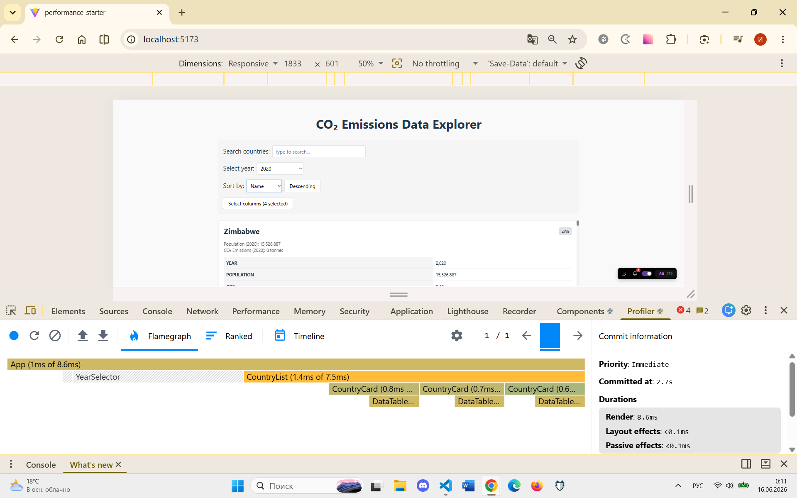
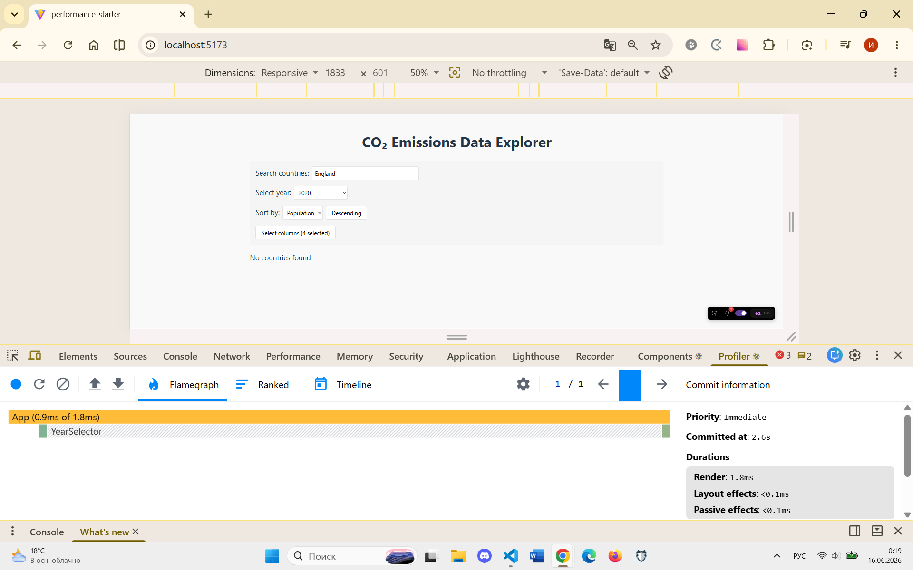
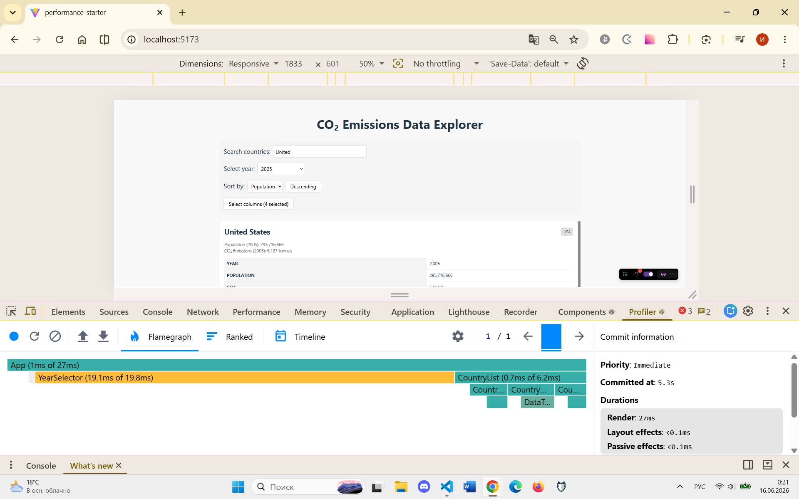
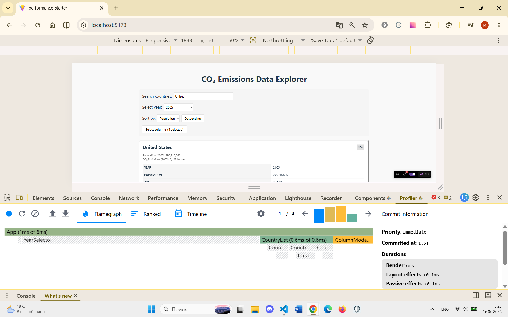

# Performance Optimization Report

## Baseline Measurements

### Interaction A: Sort countries
- **Commit duration**: 0.2 ms
- **Render duration**: 23.6 ms
- **Screenshot**: 

### Interaction B: Search countries
- **Commit duration**: 0.2 ms
- **Render duration**: 188.6 ms
- **Screenshot**: 

### Interaction C: Change year
- **Commit duration**: 0.2 ms
- **Render duration**: 326.7 ms
- **Screenshot**: 

### Interaction D: Toggle column
- **Commit duration**: 0.2 ms
- **Render duration**: 352.8 ms
- **Screenshot**: 

---

## Optimized Measurements

### Interaction A: Sort countries
- **Commit duration**: 0.2 ms
- **Render duration**: 8.6 ms
- **Screenshot**: 

### Interaction B: Search countries
- **Commit duration**: 0.2 ms
- **Render duration**: 1.8 ms
- **Screenshot**: 

### Interaction C: Change year
- **Commit duration**: 0.2 ms
- **Render duration**: 27.0 ms
- **Screenshot**: 

### Interaction D: Toggle column
- **Commit duration**: 0.2 ms
- **Render duration**: 6.0 ms
- **Screenshot**: 

---

## Summary of Improvements

| Interaction      | Baseline (ms) | Optimized (ms) | Improvement |
| ---------------- | ------------- | -------------- | ----------- |
| Sort countries   | 23.6          | 8.6            | 63.6%       |
| Search countries | 188.6         | 1.8            | 99.1%       |
| Change year      | 326.7         | 27.0           | 91.7%       |
| Toggle column    | 352.8         | 6.0            | 98.3%       |
| **Average** | **222.9** | **10.9** | **95.1%** |