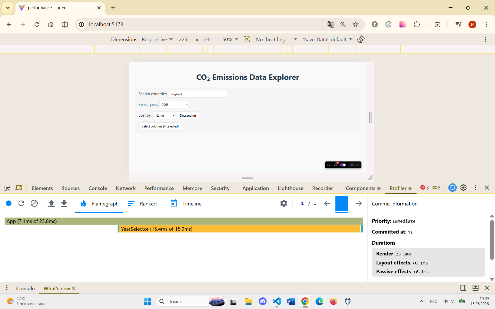
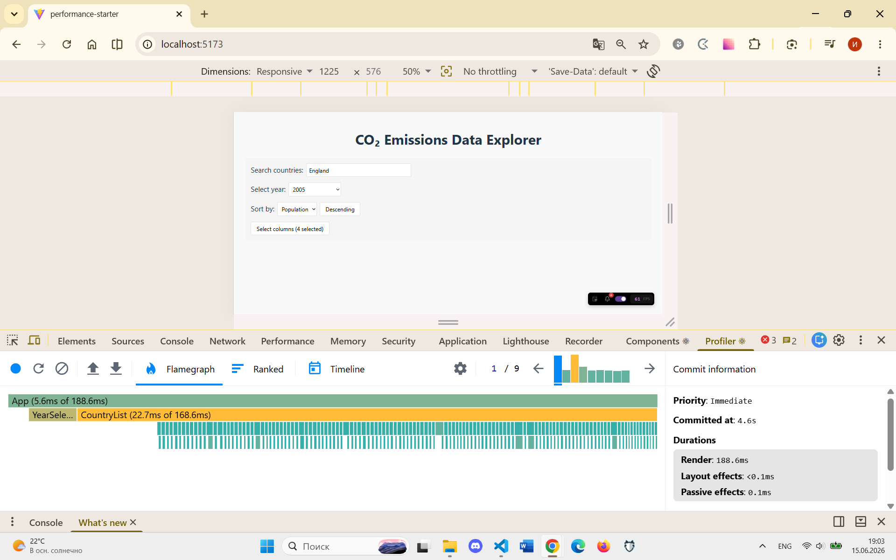
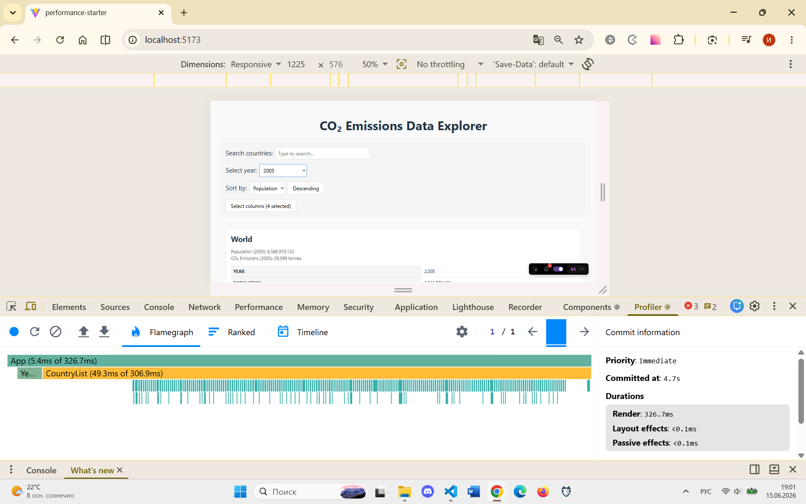
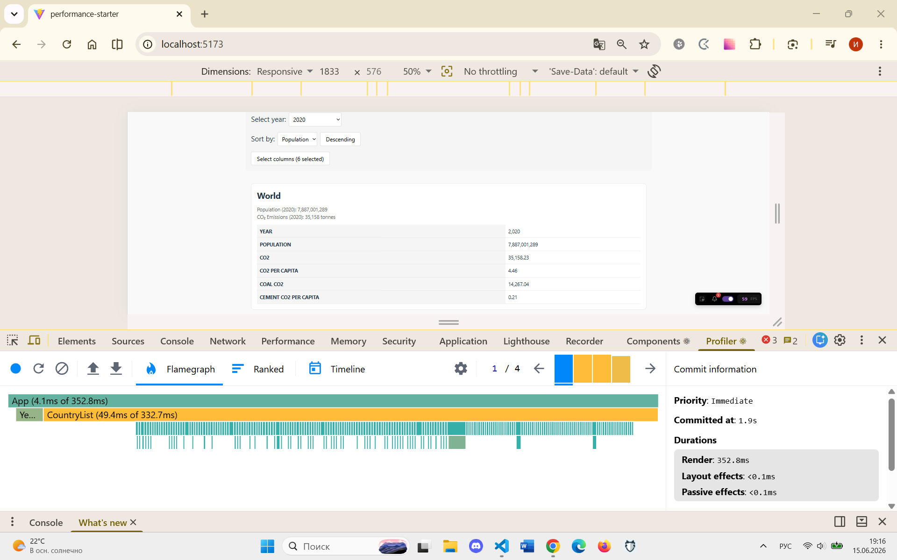

# Performance Optimization Report

## Baseline Measurements

### Interaction A: Sort countries
- **Commit duration**: 0.2 ms
- **Render duration**: 23.6 ms
- **Screenshot**: 

### Interaction B: Search countries
- **Commit duration**: 0.2 ms
- **Render duration**: 188.6 ms
- **Screenshot**: 

### Interaction C: Change year
- **Commit duration**: 0.2 ms
- **Render duration**: 326.7 ms
- **Screenshot**: 

### Interaction D: Toggle column
- **Commit duration**: 0.2 ms
- **Render duration**: 352.8 ms
- **Screenshot**: 